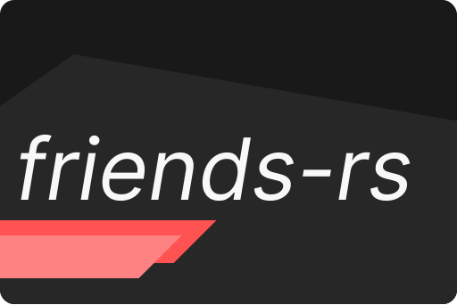

<h1 align="center">

[](https://github.com/HiddenAbilitree/friends-rs)

</h1>

<p align="center">
  <a href="https://github.com/HiddenAbilitree/friends-rs/releases"></a>
  
  
  
  <a href="https://gitmoji.dev/"></a>
</p>

> [!NOTE]
> This project is based on the work of `JacobEvelyn/friends`.
>
> <a href="https://github.com/JacobEvelyn/friends"></a>

## Tracing 🚀

<a href="https://ui.perfetto.dev/"></a>
<a href="https://crates.io/crates/tracing"></a>
<a href="https://crates.io/crates/tracing-subscriber"></a>
<a href="https://crates.io/crates/tracing-chrome"></a>

`friends-rs` has a crate feature which enables tracing via [tracing-chrome](https://crates.io/crates/tracing-chrome)
through the feature flag `tracing`. You can run `friends-rs` with tracing using:

```sh
RUST_LOG=friends=trace cargo run --features=tracing
```

...and then load the json trace (which will be named something like `trace-....json`) in [perfetto](https://ui.perfetto.dev/).
